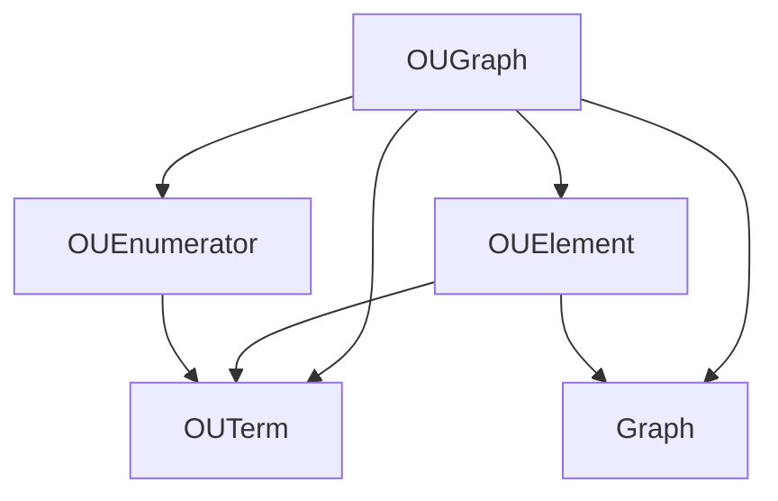

[](https://doi.org/10.5281/zenodo.8214977)
[](https://www.repostatus.org/#active)


[](https://github.com/pre-commit/pre-commit)
[](https://results.pre-commit.ci/latest/github/OntoUML/ontouml_vocabulary_lib/main)


# ontouml_vocabulary_lib

**WORK IN PROGRESS**

<p align="center"></p>

Python software that implement validation rules for OntoUML models represented as OntoUML Vocabulary graphs

**📦 PyPI Package:**
The transformation is conveniently [available as a PyPI package](https://pypi.org/project/ontouml_vocabulary_lib/), which
allows users to use it as an executable script or import it as a library into other Python projects.

**📚 Documentation:**
For inquiries and further information, please refer to
the [comprehensive docstring-generated documentation](https://w3id.org/ontouml/ontouml_vocabulary_lib/docs) available for this
project.

## Contents

<!-- TOC -->
* [ontouml_vocabulary_lib](#ontouml_vocabulary_lib)
  * [Contents](#contents)
  * [Installation and Use](#installation-and-use)
    * [Prerequisites](#prerequisites)
    * [Instructions for Users](#instructions-for-users)
    * [Instructions for Contributors](#instructions-for-contributors)
  * [Introduction](#introduction)
    * [Development Stage:](#development-stage)
    * [The OntoUML Vocabulary](#the-ontouml-vocabulary)
  * [Concepts](#concepts)
    * [RDF Graph](#rdf-graph)
    * [OUTerm](#outerm)
      * [Descriptions of the Methods:](#descriptions-of-the-methods)
      * [Usage examples](#usage-examples)
    * [OUGraph](#ougraph)
      * [Usage examples:](#usage-examples-1)
      * [OUGraph Class Method Descriptions](#ougraph-class-method-descriptions)
    * [OUElement](#ouelement)
      * [Usage examples](#usage-examples-2)
      * [OUElement Class Method Descriptions](#ouelement-class-method-descriptions)
    * [OUEnumerations](#ouenumerations)
      * [Usage examples](#usage-examples-3)
      * [OUEnumerations Class Method Descriptions](#ouenumerations-class-method-descriptions)
    * [Classes Specializing `_OUElement`](#classes-specializing-ouelement)
    * [Enumeration Classes](#enumeration-classes)
    * [Note](#note)
    * [Dependencies](#dependencies)
    * [Custom Exceptions](#custom-exceptions)
      * [Descriptions of Exceptions](#descriptions-of-exceptions)
  * [How to Contribute](#how-to-contribute)
    * [Report Issues](#report-issues)
    * [Code Contribution](#code-contribution)
    * [Test Contribution](#test-contribution)
    * [General Guidelines](#general-guidelines)
<!-- TOC -->

## Installation and Use

### Prerequisites

Ensure you have Python installed on your system before utilizing `ontouml_vocabulary_lib`. It has been tested with Python versions 3.9 to 3.11 on Mac, Windows, and Linux. If not installed, [download and install Python](https://www.python.org/downloads/).

### Instructions for Users

1. Install ontouml_vocabulary_lib: Execute the following command to install the library:

```shell
pip install ontouml_vocabulary_lib
```
All dependencies will be installed automatically.

2. Usage: To use ontouml_vocabulary_lib, import the necessary functionalities in your Python code. Example:

```python
from ontouml_vocabulary_lib import YourFunctionOrClass
```

Note: Replace YourFunctionOrClass with the actual function or class you intend to use.

### Instructions for Contributors

1. **Fork the Project:**
   Fork the `ontouml_vocabulary_lib` repository to your own GitHub account.

2. **Clone and Setup:**
   Clone your forked repository and navigate to the project directory.

3. **Install Dependencies:**
   Use [Poetry](https://python-poetry.org/) for dependency management. If not installed, refer to Poetry’s [documentation](https://python-poetry.org/docs/#installation) for installation instructions. Then, install all dependencies with:
   ```shell
   poetry install
   ```

Now, you're ready to make enhancements or fixes and contribute back to ontouml_vocabulary_lib!

## Introduction

**ontouml_vocabulary_lib
** is a Python library tailored for managing RDF graphs with a particular emphasis on OntoUML specifics. Inspired by [OntoUML-JS](https://w3id.org/ontouml/js), this library extends [RDFLib](https://rdflib.readthedocs.io/en/stable/)'s functionalities to accommodate the distinctive requirements of OntoUML.

The library complies with the [OntoUML vocabulary]((https://w3id.org/ontouml/vocabulary))—ensuring compatibility with its [version 1.1.0](https://w3id.org/ontouml/vocabulary/v1.1.0)—and providing functionalities for adept manipulation of RDF graphs, with due consideration to OntoUML principles.

### Development Stage:

ontouml_vocabulary_lib is still under active development. It currently provides limited functionality and is progressively being extended to offer a comprehensive toolset for OntoUML and RDF graph interaction.

Your contributions and feedback are valuable in enhancing ontouml_vocabulary_lib and expanding its capabilities!

### The OntoUML Vocabulary

OntoUML is a modeling language that has been developed to support the representation of domain ontologies in the conceptual modeling phase of system development. The [OntoUML Vocabulary](https://w3id.org/ontouml/vocabulary), on the other hand, is an OWL vocabulary designed to allow the serialization and exchanging of OntoUML models in conformance with the [OntoUML Metamodel](https://w3id.org/ontouml/metamodel). By providing a systematic and semantically sound basis for model conceptualization, OntoUML aims to foster the construction of more precise and problem-oriented models in the context of complex systems engineering.

The OntoUML Vocabulary provides the necessary resources for mapping OntoUML models to OWL ontologies, which is a crucial step for utilizing OntoUML in ontology-driven conceptual modeling tasks. This mapping process ensures that the semantics of OntoUML models are adequately represented in the OWL ontologies, thereby preserving the integrity and meaning of the models when they are exchanged or processed further. Moreover, the ontology file `ontouml.ttl` in the Vocabulary is rich with metadata, including a description, author information, and versioning details, which are crucial for understanding and managing OntoUML models in a collaborative modeling environment.

### The RDFLib

[RDFLib](https://rdflib.readthedocs.io/en/stable/) is a Python library that provides a comprehensive toolkit for working with [Resource Description Framework (RDF)](https://www.w3.org/RDF/) data, which is fundamental to the [Semantic Web](https://www.w3.org/standards/semanticweb/) and linked data technologies. RDFLib enables developers to create, manipulate, and query RDF graphs, making it a powerful tool for representing and exchanging structured information in a machine-readable format. With RDFLib, users can parse RDF data, build RDF graphs programmatically, and perform complex queries to extract valuable insights from linked data sources. Its versatility and robust features make it a vital component for applications involving knowledge representation, ontology modeling, and semantic data integration within the Python ecosystem.

### The OntoUML-JS

[OntoUML JS](https://github.com/OntoUML/ontouml-js) is a versatile JavaScript library tailored for effortlessly handling OntoUML models. It streamlines the process of manipulating OntoUML models and serializing them into [`ontouml-schema`](https://github.com/OntoUML/ontouml-schema) compliant JSON files. With OntoUML JS, developers can efficiently create and manage OntoUML elements, construct models, and perform various model-related tasks programmatically. This library introduces constructor methods for creating OntoUML elements, provides support for container elements like projects and packages, and facilitates element serialization and deserialization. Additionally, OntoUML JS is continually updated with useful methods to simplify the development of OntoUML models. Whether you are working on ontology-driven conceptual modeling or require a tool for handling complex domain ontologies, OntoUML JS offers a valuable utility to streamline your workflow.

## ontouml_vocabulary_lib Concepts

When working with the ontouml_vocabulary_lib library, users will primarily engage with five fundamental concepts, each contributing to the seamless manipulation of OntoUML models and RDF graphs. These key concepts include OUTerm, which represents OntoUML terms and ensures semantic consistency; OUElement, serving as a container for various OntoUML model elements and maintaining their structured details; OUGraph, a pivotal orchestrator for OntoUML vocabulary elements within RDF graphs, enabling systematic access and manipulation; OUEnumeration, which provides organized enumerations for OntoUML concepts and stereotypes; and Graph, a core concept from RDFLib, offering a structured framework for managing RDF data. Together, these concepts empower users to efficiently handle OntoUML models, navigate their semantic complexities, and interact with RDF graphs, making ontouml_vocabulary_lib a valuable tool for ontology-driven conceptual modeling and semantic web technologies.

### RDF Graph

Originating from [RDFLib](https://rdflib.readthedocs.io/en/stable/_modules/rdflib/graph.html), the RDF Graph is not a native concept to the `ontouml_vocabulary_lib` library but is integral in managing OntoUML data within a semantic and structured framework.

- Accesses: No other concepts.
- Accessed By: Directly, OUGraph, OUElement.

The RDF Graph plays a pivotal role in:
- Serializing and deserializing OntoUML models.
- Enabling structured querying and manipulation of OntoUML data.
- Handling triples, the basic structural units in RDF data, for managing OntoUML elements.


### OUTerm

A key concept in the library is the OUTerm, which allows users to easily work with terms from the OntoUML vocabulary. This means you can retrieve, manipulate, and employ various ontological terms directly, enhancing the accuracy and consistency of your ontology model. Additionally, the library incorporates the URIRef concept from RDFLib, letting you use universal resource identifiers for defining relationships and properties clearly and unambiguously. Together, these concepts offer a straightforward and effective way to develop and share your ontologies.

OUTerm serves as a reference to a term in the OntoUML Vocabulary, offering usability akin to RDFLib for OWL, RDF, and similar formats. The returned type upon usage is URIRef.

- Accesses: No other concepts.
- Accessed By: Directly, OUEnumeration, OUGraph, and OUElement.

#### Descriptions of the Methods:

- **list_all**: Provides all OntoUML terms defined in the OntoUML Vocabulary as a list of URIRef objects.
- **get_namespace**: Likely returns the namespace of OntoUML.
- **get_term**: Retrieves a specific OntoUML term as a URIRef, given a term name as a string.

| Method Name     | Description                         | Input Arguments  | Output Arguments   |
|-----------------|-------------------------------------|------------------|--------------------|
| `list_all`      | Lists all OntoUML terms as URIRefs  | None             | List of `URIRef`   |
| `get_namespace` | Retrieves the namespace for OntoUML | None             | `str`              |
| `get_term`      | Gets a specific OntoUML term        | `term_name: str` | `URIRef` or `None` |

#### Usage examples

1. Accessing an OntoUML Term:
```python
from ontouml_namespace import OntoUML

# Accessing a specific OntoUML term
my_ontouml_class = OntoUML.Class

# Output
print(my_ontouml_class)
```
Result:
```txt
https://w3id.org/ontouml#Class
```

The result "https://w3id.org/ontouml#Class" from box 1 is of [type URIRef in RDFLib](https://rdflib.readthedocs.io/en/stable/rdf_terms.html#uriref), which represents a Uniform Resource Identifier (URI) within the Resource Description Framework (RDF) data model, serving as a unique identifier for resources in semantic web technologies.

2. Accessing all OntoUML Terms

```python
from ontouml_namespace import OntoUML

# Accessing all OntoUML terms
all_terms = OntoUML.get_list_all()

# Output
print(all_terms)
```
Result:
```txt
[rdflib.term.URIRef('https://w3id.org/ontouml#abstract'),
 rdflib.term.URIRef('https://w3id.org/ontouml#abstractNature'),
 rdflib.term.URIRef('https://w3id.org/ontouml#aggregationKind'),
 ...]
```
As can be seen, the result is a list of URIRefs.

### OUGraph

OUGraphs stand as a pivotal concept in managing and orchestrating OntoUML vocabulary elements extracted from an RDF graph. The utility, OUGraph, ingeniously curates and compartmentalizes these elements into structured lists, depending on their type, thus enabling a seamless and systematic access and manipulation of the OntoUML elements. Whether it's dealing with diverse OntoUML elements like Class, Relation, Generalization, and more, or their visual representations in diagrams, OUGraph capacitates users to load, add, and even write these elements back into an RDF graph, ensuring that the model data is not only stored but can be utilized, analyzed, and manipulated effectively for further research and model development.

This python class, enriched with methods for adding elements, reading, and writing into RDF graphs, and moreover, handling both abstract and concrete syntax elements, becomes an instrumental tool in managing OntoUML schema in RDF format. Therefore, OUGraphs not only uphold the integrity of the OntoUML's conceptual model structure but also pave the way for a more coherent and systematic management and utilization of OntoUML vocabulary elements in computational environments.

- Accesses: OUEnumeration, OUTerm, OUElement, Graph.
- Accessed By: Directly only.

#### Usage examples:
1. Loading OntoUML Elements from an RDF Graph
To begin with, you'll need an RDF graph (using the rdflib library) populated with OntoUML elements.

```python
from rdflib import Graph

# Create a new RDF graph and populate it with OntoUML elements
rdf_graph = Graph()
# ... [insert RDF triples relating to OntoUML elements here] ...
```

Next, instantiate OUGraph and use the read_graph method to load and organize OntoUML elements into lists.

```python
from ontouml_vocabulary_lib.classes.ougraph import OUGraph

ou_graph = OUGraph()
ou_graph.read_graph(rdf_graph)
```

2. Accessing OntoUML Elements from OUGraph
Once OntoUML elements are loaded into OUGraph, you can access them through their respective lists.

```python
# Access and print all OntoUML Class elements
for ou_class in ou_graph.ou_class_list:
    print(f"OntoUML Class: {ou_class}")
```

3. Adding a New OntoUML Element to OUGraph
To add a new OntoUML element to OUGraph, create an instance of the desired element type and use the add_element method.

```python
from ontouml_vocabulary_lib.classes.ouelement.oumodelelement.ouclassifier.ouclass import OUClass

# Create a new OntoUML Class element
new_ou_class = OUClass(URIRef("example_id"))

# Add the new element to ou_graph
ou_graph.add_element(new_ou_class)
```
4. Writing OntoUML Elements to an RDF Graph
If you wish to export your OntoUML elements from OUGraph to an RDF graph, you can utilize the write_graph method.

```python
# Create a new RDF graph to store OntoUML elements
output_rdf_graph = Graph()

# Write OntoUML elements from ou_graph to the new RDF graph
ou_graph.write_graph(output_rdf_graph)
```

#### OUGraph Class Method Descriptions

- **add_element**: Adds a specified OntoUML element to the OUGraph.
- **read_graph**: Loads OntoUML elements from a provided RDF graph into the OUGraph.
- **write_graph**: Exports the OntoUML elements stored in the OUGraph into a provided RDF graph.

| Method Name   | Description                                                             | Input Arguments                              | Output Arguments |
|---------------|-------------------------------------------------------------------------|----------------------------------------------|------------------|
| `add_element` | Adds an OntoUML element to the relevant type list.                      | `element: _OUElement`                        | `None`           |
| `read_graph`  | Loads OntoUML elements from a provided RDF graph.                       | `rdf_graph: Graph`, `include_concrete: bool` | `None`           |
| `write_graph` | Exports the OntoUML elements stored in the `OUGraph` into an RDF graph. | `rdf_graph: Graph`, `include_concrete: bool` | `None`           |

### OUElement

OUElement is a concept used in OntoUML, a system designed to help create clear and detailed models, which helps us understand and organize complex information. In short, OUElement represents different types of elements you might use when building a model, like classes or relationships. It keeps track of all necessary details, like its name or type, using a format called URI references. So, when you're making a model, OUElement acts like a container, holding and managing all the information about the parts you're using, making sure everything is structured and easy to work with. It's like a toolbox for model-making, helping to keep everything in order and making it easier to share detailed ideas with others.

- Accesses: OUTerms and Graphs.
- Accessed By: Directly, OUGraphs.

#### Usage examples
1. Creating an Instance of OUClass
```python
from rdflib import URIRef
from your_module import OUClass  # Replace with your actual module path

# Creating an instance of OUClass
my_class = OUClass(
    object_id=URIRef("http://example.org/my_class"),
    name=URIRef("Person"),
    description=URIRef("A human individual."),
    isAbstract=URIRef("False"),
    stereotype=URIRef("Kind")
)
```
In this example, we create a new OntoUML class named "Person" with a description, and stereotype "Kind". Notice how URIRef is used to create URI references for all parameters.

2. Modifying an Instance of OUClass After Creation

```python
from rdflib import URIRef
from your_module import OUClass  # Replace with your actual module path

# Creating an instance of OUClass
c = OUClass(object_id=URIRef("http://example.org/my_id"))

# Modifying attributes after instantiation
c.name = URIRef("http://example.org/my_name")
c.description = URIRef("http://example.org/A_description_about_the_class")
```
In this example an instance c of OUClass is created with an object_id parameter provided, and the rest of the parameters are kept as default (None, if they're optional).
After instantiation, we dynamically assign values to its name and description attributes.

3. Adding OUClass Instance to an RDF Graph
After creating an instance of OUClass, it can be added to an RDF graph using its attributes. Here’s a simple example considering that you implement the add_to_rdf_graph method following the logic of _OUElement:
```python
from rdflib import Graph

# Creating a new RDF graph
graph = Graph()

# Adding the my_class instance to the RDF graph
my_class.add_to_rdf_graph(graph)
```

In your full implementation, you'll likely have 20 other specialized classes similar to OUClass, each tailored for different OntoUML concepts (e.g., OURelationship, OUProperty, etc.). The creation and usage of instances of those classes would follow a similar pattern as outlined in the examples, tailored to the unique attributes and behaviors of each class type.

#### OUElement Class Method Descriptions

- **add_to_rdf_graph**: Integrates the instance data into an RDF graph.

| Method Name        | Description                                                                                                                                                         | Input Arguments | Output Arguments |
|--------------------|---------------------------------------------------------------------------------------------------------------------------------------------------------------------|-----------------|------------------|
| `add_to_rdf_graph` | Integrates instance data into an RDF graph, forming triples that represent semantic relationships in OntoUML models, and logs issues without halting on exceptions. | `graph: Graph`  | `None`           |

### OUEnumerations


The provided implementation outlines a strong structure for defining and managing OntoUML concepts within a Python context using enumerations. `_OUEnumeration`, a foundational base class, enriches Python’s Enum class by introducing a utility method to retrieve all members of an enumeration, thus simplifying various tasks like iterating over values. Specialized enumerations like `OUBaseSortalClass`, `OUUltimateSortalClass`, and `OUClassStereotype`, amongst others, allow for a semantically rich and organized way to manage OntoUML concepts and stereotypes. For instance, `OUBaseSortalClass` encapsulates stereotypes defined as base sortals, such as historical role and phase, while `OUClassStereotype` represents an overarching enumeration encapsulating all OntoUML class stereotypes. Developers and data modelers can leverage these enumerations to utilize, check, and validate OntoUML concepts within their Python applications, ensuring semantic consistency and facilitating tasks like model creation, validation, and visualization in OntoUML. For example, one can easily iterate over all OntoUML class stereotypes using `OUClassStereotype.get_all()`, or check if a specific stereotype belongs to base sortals by checking if it is in `OUBaseSortalClass.get_all()`, thus offering a structured, yet flexible, framework for handling OntoUML modeling tasks programmatically.

- Accesses: OUTerms.
- Accessed By: Directly, OUGraphs.

#### Usage examples

1. Retrieving All Values from an Enumeration
```python
# Retrieving all values from the `OUBaseSortalClass` enumeration
all_base_sortals = OUBaseSortalClass.get_all()

# Output the values
print("All Base Sortal Stereotypes:")
print(all_base_sortals)
```

2. Validating an OntoUML Concept against an Enumeration
```python
# A given OntoUML Concept (Assume OntoUML.kind is of type URIRef)
given_ontouml_concept = OntoUML.kind

# Validate if it's a base sortal
is_base_sortal = given_ontouml_concept in OUBaseSortalClass.get_all()

# Output the validation result
print(f"Is {given_ontouml_concept} a base sortal stereotype?")
print("Yes" if is_base_sortal else "No")
```

3. Dynamically Using Enumeration Based on User Input
```python
def list_ontology_concepts(ontology_type):
    """Lists all OntoUML concepts of a specified type."""
    try:
        enum_class = getattr(sys.modules[__name__], ontology_type)
        all_concepts = enum_class.get_all()
        print(f"All {ontology_type} concepts:")
        print(all_concepts)
    except AttributeError:
        print(f"No enumeration found for {ontology_type}.")

# Example usage
# Assuming the user provides input for the desired ontology type to list
user_input = "OUBaseSortalClass"  # for example purpose, replace with actual user input in practice
list_ontology_concepts(user_input)
```

4. Comparing Values between Different Enumerations
```python
# Retrieve all ultimate and base sortals
all_ultimate_sortals = OUUltimateSortalClass.get_all()
all_base_sortals = OUBaseSortalClass.get_all()

# Find common stereotypes between ultimate and base sortals, if any
common_stereotypes = set(all_ultimate_sortals).intersection(set(all_base_sortals))

# Output common stereotypes
print("Common stereotypes between Ultimate and Base Sortals:")
print(common_stereotypes)
```

5. Using Enumeration in OntoUML Modeling
```python
class OntoUMLModel:
    """A basic representation of an OntoUML Model."""

    def __init__(self, stereotypes):
        """Initializes the model with given stereotypes if valid."""
        # Assume OntoUML.role is of type URIRef
        self.stereotypes = [s for s in stereotypes if s in OUClassStereotype.get_all()]

    def add_stereotype(self, stereotype):
        """Adds a stereotype if it's a valid OntoUML class stereotype."""
        if stereotype in OUClassStereotype.get_all():
            self.stereotypes.append(stereotype)
        else:
            print(f"{stereotype} is not a valid OntoUML class stereotype.")

    # Additional model management methods...

# Example usage
# Assume OntoUML.role and OntoUML.kind are of type URIRef
model = OntoUMLModel([OntoUML.role, OntoUML.kind])
model.add_stereotype(OntoUML.quality)  # Assumes to be a valid OntoUML stereotype
```

Note that in these examples, you would replace the stubs like OntoUML.role and OntoUML.kind with actual URIRef objects or other suitable representations based on your actual OntoUML implementation, as they were not provided in your code snippet. This provides a few ways in which the _OUEnumeration and its children can be used to handle OntoUML concepts in a Python application, enabling tasks like validation, exploration, and management of OntoUML stereotypes and concepts.

#### OUEnumerations Class Method Descriptions

- **get_all**: Returns a list of all enumeration members.

| Method Name | Description                                                                                    | Input Arguments | Output Arguments |
|-------------|------------------------------------------------------------------------------------------------|-----------------|------------------|
| `get_all`   | Retrieves a list of all enumeration members' values to facilitate member iteration or display. | `None`          | `list[URIRef]`   |

### Classes Specializing `_OUElement`

- **RedefinableOUElement**
    - **Subclasses**: OUClass, OUAssociation, OUDataType, OUGeneralization, OUGeneralizationSet
    - **Methods**:
        - **add_to_rdf_graph**: Incorporates instance data into an RDF graph, forming semantically accurate triples and logging issues without terminating on exceptions.

### Enumeration Classes

- **OUKind**, **OUSubkind**, **OUPhase**, **OUQuantity**, **OUCollective**, **OUAbstract**, **OUQuality**, **OUMode**, **OUGeneralizationSet**
- **Method Description**:
    - **get_all**: Retrieves a list of all enumeration members’ values to facilitate member iteration or display.

### Note

**1.** Descriptions for the methods might not cover all edge cases or alternative behaviors, depending on actual implementation and design decisions in the code.
**2.** The above enumeration classes and specialized classes are intended to serve representative purposes and might contain actual, anticipated, or placeholder names based on the provided context.

### Dependencies



### OntoUML Custom Exceptions

This document provides a detailed explanation of the custom exceptions used in the handling and management of OntoUML graphs and related operations. These custom exceptions are designed to provide explicit and user-friendly error messages, assisting developers in debugging and resolving issues.

#### Descriptions of Exceptions

- **OUInvalidAttribute**: Raised when an invalid attribute is accessed on an OntoUML class.
- **OUUnavailableTerm**: Raised when an OUTerm is not available or does not exist in the OntoUML Vocabulary.
- **OUInvalidElementType**: Raised when an OUElement is not mapped to an internal list within the OUGraph, signifying a lack of mapping definitions in the graph management logic.
- **InvalidOntoUMLTypeException**: Raised when an individual is not from a valid OntoUML type.

| Exception Name                | Description                                                               |
|-------------------------------|---------------------------------------------------------------------------|
| `OUInvalidAttribute`          | Raised when an invalid attribute is accessed on an OntoUML class.         |
| `OUUnavailableTerm`           | Raised when an OUTerm is not available in the OntoUML Vocabulary.         |
| `OUInvalidElementType`        | Raised when an OUElement isn't mapped in the OUGraph's internal list.     |
| `InvalidOntoUMLTypeException` | Raised when an individual is not from a valid OntoUML type.               |

### Functions Provided

This section elucidates the utility functions available in the module, designed to assist in manipulating and managing OntoUML graphs and related operations through the `ontouml_vocabulary_lib` library. The functions serve to provide additional, straightforward functionalities for developers, ensuring efficient interaction with OntoUML concepts.

#### ou_create_element Function

def ou_create_element(individual_id: URIRef, individual_type: URIRef) -> _OUElement:

The `ou_create_element` function is designed to generate OntoUML elements by mapping RDF individuals to their corresponding classes within the `ontouml_vocabulary_lib` library. It accepts the ID and type of an RDF individual as input arguments and returns an instance of the pertinent OntoUML class, leveraging a predefined mapping between OntoUML types and `ontouml_vocabulary_lib` classes to ascertain which class to instantiate.

- **Parameters:**
    - `individual_id`: RDF ID of the individual to be mapped.
    - `individual_type`: RDF type of the individual to be mapped.

- **Return Type:**
    - An instance of an `ontouml_vocabulary_lib` class corresponding to the RDF individual type provided.

- **Raises:**
    - `InvalidOntoUMLTypeException`: If the `individual_type` does not correspond to a valid OntoUML type.

The function essentially forms a bridge between RDF individual representations and the robust class structures offered by `ontouml_vocabulary_lib`, ensuring a coherent and type-consistent mapping. Developers can utilize this function to conveniently instantiate objects representing OntoUML elements based on their RDF descriptions, without delving into the intricacies of individual class instantiation and management.

##### Basic Usage Examples

1. Creating an OntoUML Class Element

In this example, we'll create an instance of an OntoUML class using the `ou_create_element` function.

```python
from rdflib import URIRef
from ontouml_vocabulary_lib.classes.ouelement.oumodelelement.ouclassifier.ouclass import OUClass

individual_id = URIRef("http://example.org/ontouml#Person")
individual_type = URIRef("http://example.org/ontouml#Class")

try:
    ou_element = ou_create_element(individual_id, individual_type)
    print(f"Created {type(ou_element).__name__} instance with ID: {ou_element.id}")
except InvalidOntoUMLTypeException as e:
    print(f"Error: {str(e)}")
```
Expected Output:
```txt
Created OUClass instance with ID: http://example.org/ontouml#Person
```

3. Handling Invalid OntoUML Type
Here, we'll try to create an instance with an invalid OntoUML type and handle the exception gracefully.
```python
individual_id = URIRef("http://example.org/ontouml#Person")
invalid_individual_type = URIRef("http://example.org/ontouml#InvalidType")

try:
    ou_element = ou_create_element(individual_id, invalid_individual_type)
    print(f"Created {type(ou_element).__name__} instance with ID: {ou_element.id}")
except InvalidOntoUMLTypeException as e:
    print(f"Error: {str(e)}")
```
Expected Output:
```txt
Error: The 'http://example.org/ontouml#InvalidType' is not a valid OntoUML element type.
```

3. Working with Relation Elements
Attempting to create a relation element instance using ou_create_element function.
```python
from ontouml_vocabulary_lib.classes.ouelement.oumodelelement.ouclassifier.ourelation import OURelation

individual_id = URIRef("http://example.org/ontouml#Marriage")
individual_type = URIRef("http://example.org/ontouml#Relation")

try:
    ou_element = ou_create_element(individual_id, individual_type)
    print(f"Created {type(ou_element).__name__} instance with ID: {ou_element.id}")
except InvalidOntoUMLTypeException as e:
    print(f"Error: {str(e)}")
```

Expected Output:
```txt
Created OURelation instance with ID: http://example.org/ontouml#Marriage
```


## How to Contribute

### Report Issues

- Report bugs or suggest features by [opening an issue](https://github.com/OntoUML/ontouml_vocabulary_lib/issues/new).
- Point out any discrepancies in the AI-generated documentation by [opening an issue](https://github.com/OntoUML/ontouml_vocabulary_lib/issues/new).

### Code Contribution

1. Fork the Repository: Fork the project repository and create your feature branch: `git checkout -b feature/YourFeatureName`.
2. Commit Changes: Make and commit your changes with meaningful commit messages.
3. Push to Branch: Push your work back up to your fork: `git push origin feature/YourFeatureName`.
4. Submit a Pull Request: Open a pull request to merge your feature branch into the main project repository.

### Test Contribution

- Improve reliability by adding or enhancing tests.

### General Guidelines

- Ensure your code adheres to our coding standards.
- Update documentation as needed.
- Ensure that your code does not introduce additional issues.

Thank you for investing your time and expertise into this project!

## Author

This project is maintained by the [Semantics, Cybersecurity & Services (SCS) Group](https://www.utwente.nl/en/eemcs/scs/) of the [University of Twente](https://www.utwente.nl/), The Netherlands. Its developer is:

- [Pedro Paulo Favato Barcelos](https://orcid.org/0000-0003-2736-7817) [[GitHub](https://github.com/pedropaulofb)] [[LinkedIn](https://www.linkedin.com/in/pedro-paulo-favato-barcelos/)]

Feel free to get in touch using the provided links. For questions, contributions, or to report any problem, you can **[open an issue](https://github.com/OntoUML/ontouml_vocabulary_lib/issues/new)** at this repository.
